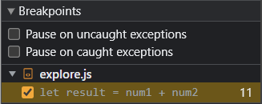
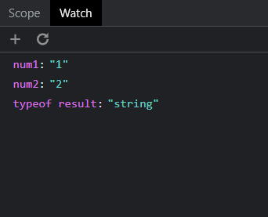
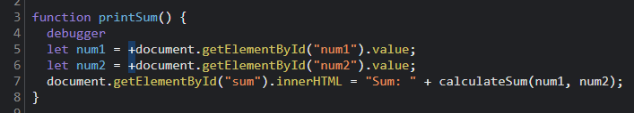

1. The bug is that `num1` and `num2` were strings because `HTMLInputElement.prototype.value` on lines 5 and 6 returns a string, so adding them together on line 11 concatenated the strings rather than adding them as numbers.

2. I would fix it by casting the input values to numbers using the unary `+` operator before storing them in `num1` and `num2` on lines 5 and 6.

   ```diff
   -   let num1 = document.getElementById("num1").value;
   -   let num2 = document.getElementById("num2").value;
   +   let num1 = +document.getElementById("num1").value;
   +   let num2 = +document.getElementById("num2").value;
   ```

   
